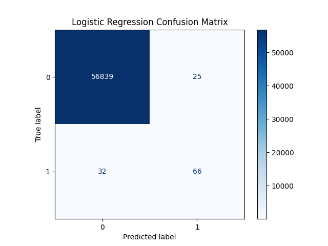
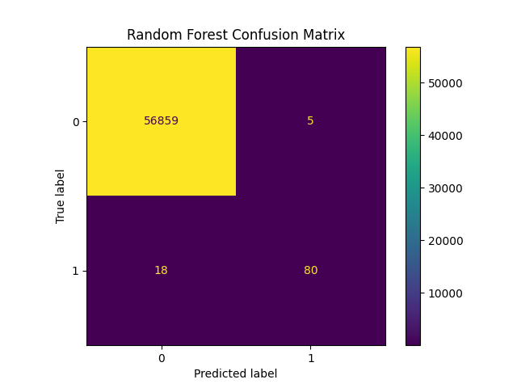
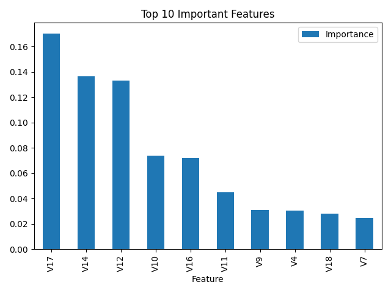

# Credit Card Fraud Detection

## 🎯 Problem Statement
Credit card fraud costs banks and consumers billions annually. This project builds a machine learning model to detect fraudulent transactions with high accuracy while minimizing false alarms.

## 📊 Dataset
- Highly imbalanced credit card transactions (0.17% fraud)
- 284,807 transactions
- 31 features (anonymized PCA components V1-V28, Time, Amount)

## 🚀 Models Implemented

| Model | Precision | Recall | F1-Score | Fraud Detected | False Alarms |
|-------|-----------|--------|----------|----------------|--------------|
| Logistic Regression | 82.9% | 64.3% | 0.72 | 63/98 | 13 |
| **Random Forest** | **94.1%** | **81.6%** | **0.87** | **80/98** | **5** |

## 🔍 Key Findings
- **Random Forest outperforms Logistic Regression** by detecting 17 more fraud cases
- Reduced false alarms from 13 → 5 (62% improvement)
- Top 3 features (V17, V14, V12) drive 44% of prediction power

## 📈 Visualizations
- Confusion Matrix - Shows true/false positives & negatives
- Feature Importance - Identifies top fraud indicators

## 📊 Visualizations

### Logistic Regression

### Random Forest

### Feature Importance

